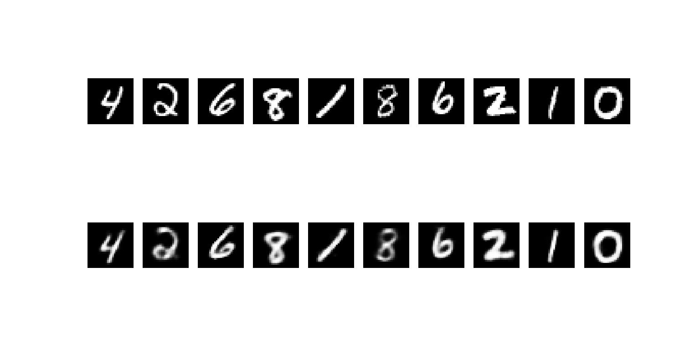

#### Mandate Autoencoder

*results from our trained autoencoder*

Introducing a high-level python wrapper to train and perform inference a linear autoencoder. There are different types of autoencoder and most popular tutorials focus on ConvNet Autoencoder including UToronto (https://www.cs.toronto.edu/~lczhang/360/lec/w05/autoencoder.html)

Linear or original Dense network based autoencoder is the primary autoencoder which uses the fundamental principle of Neural Networks and compress an image and decompress it to keep only the high-level features. We have made this repo to have it customizable and train a network with minimum effort. 

##### How to use it?
Download this repo and go inside it. Then 

```
python train.py
```

Or if you want to write your own training function, feel free to do:
```
from model import model
......
write your code
```

Perform inference 
```
python inference.py
````

#### Trained model
We also provide our trained models in the model folder called **autoencoder.pth**